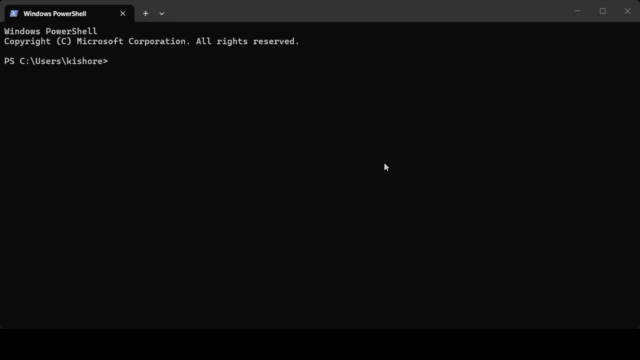

<div align="center">


<br><br>

### Discord Game Activity Spoofer
*Lightweight CLI process spoofer for Discord game quests*

<br>

[](https://www.python.org/)
[](LICENSE)
[]()

</div>

---

## ✦ Overview

**DisPlay** is a lightweight, zero-dependency CLI tool created specifically to fight gigabyte bandwidth waste during Discord Game Quests. 

Downloading giant **50 GB – 100 GB game clients** for a game you don't even plan to play, simply to leave it open for 15 minutes to claim a reward, is a massive waste of bandwidth, time, and storage. **DisPlay** instantly creates lightweight process image binaries matching Discord's official detectable games database so Discord detects you as playing.

> ⚠️ **Video & Ad Quests Excluded**: Video, stream, and promotional ad quests (1 – 5 minute ads) are intentionally excluded. No one is too busy to watch a short ad; DisPlay is specifically designed to save gigabytes of data wasted on 15-minute game opening requirements.

---

## ✦ Preview

<div align="center">



</div>

---

## ✦ How It Works

```text
┌─────────────┐
│ Select Game │
└──────┬──────┘
       ↓
┌─────────────────┐
│ Find Executable │
└──────┬──────────┘
       ↓
┌─────────────────┐
│ Create Process  │
└──────┬──────────┘
       ↓
┌──────────────┐
│ Discord sees │
│ game process │
└──────────────┘
```

Discord Desktop's built-in game scanner monitors active local OS processes (`tasklist` on Windows, `ps` on Linux/macOS) for registered game image names (e.g. `endfield.exe`, `league of legends.exe`). **DisPlay** instantiates a lightweight, safe process binary matching the exact executable name registered in Discord's detectable application database.

---

## ✦ Key Features

- **⚡ Save Gigabytes of Data**: Fulfill 15-minute quest requirements without downloading 50 GB – 100 GB game installations.
- **🔍 Dynamic Game Search**: Queries Discord's official detectable applications API in real time.
- **📦 Zero Required Dependencies**: Built using Python's standard library (`urllib.request`), requiring zero mandatory `pip install` packages.
- **🛡️ No Credential Access**: Does not request, handle, or transmit Discord tokens, passwords, or authenticated endpoints.
- **🎨 Charm / Bubbletea TUI**: Soft pastel truecolor aesthetics, braille spinner animations, and panel cards.
- **🌐 Cross-Platform Support**: Native process handling on Windows, Linux, and macOS. Unix-like environments (Termux / PyDroid 3 / iSH) may work depending on available shell support.

---

## ✦ Quick Start

### 1. Clone the Repository
```bash
git clone https://github.com/MKishoreDev/DisPlay.git
cd DisPlay
```

### 2. Run DisPlay
```bash
python display.py
```

---

## ✦ Usage Guide

1. Launch `python display.py` in your terminal.
2. Search for the game required by your Discord quest (e.g., `Arknights: Endfield` or `League of Legends`).
3. Select your game from the search results.
4. **Leave the spoofer window open as it is!**
   - A clean process window will open to maintain OS process presence for Discord.
   - **DO NOT CLOSE** the spoofer window until your quest finishes.
5. Your main **DisPlay** terminal tracks your live remaining time (`⏱ 14m 58s remaining`).
6. Once the 15 minutes complete, claim your reward on Discord!

---

## ✦ Quick Links & Documentation

- 🛡️ **[Read Legal Disclaimer & Safety Notice](DISCLAIMER.md)**
- 🤝 **[Contribution Guidelines](CONTRIBUTING.md)**
- 📜 **[Code of Conduct](CODE_OF_CONDUCT.md)**
- 🔒 **[Security Policy](SECURITY.md)**

---
---

<div align="center">

### Made with ❤️ by [Kishore](https://github.com/MKishoreDev)

[**@MKishoreDev**](https://github.com/MKishoreDev) · [**`k4isszluv`**](https://discord.com/users/1137667373307011192)

<br>

[](https://discord.com/users/1137667373307011192)

<br>

Released under the **[MIT License](LICENSE)** · © 2026 **[Kishore](https://github.com/MKishoreDev)**

<br>

</div>
